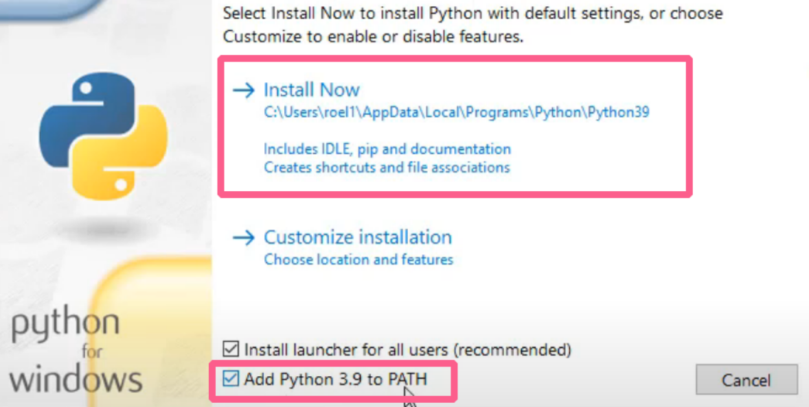
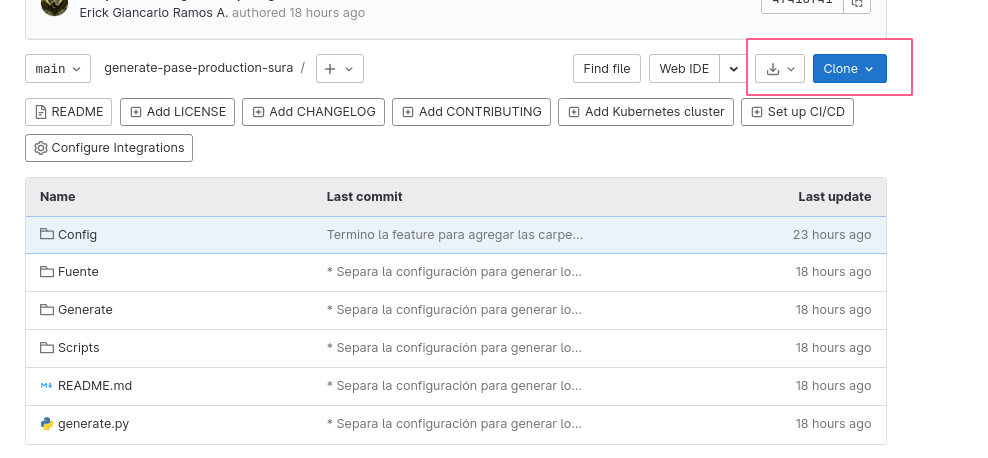
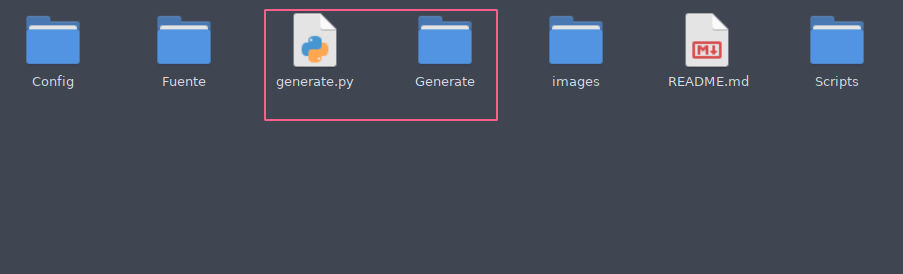
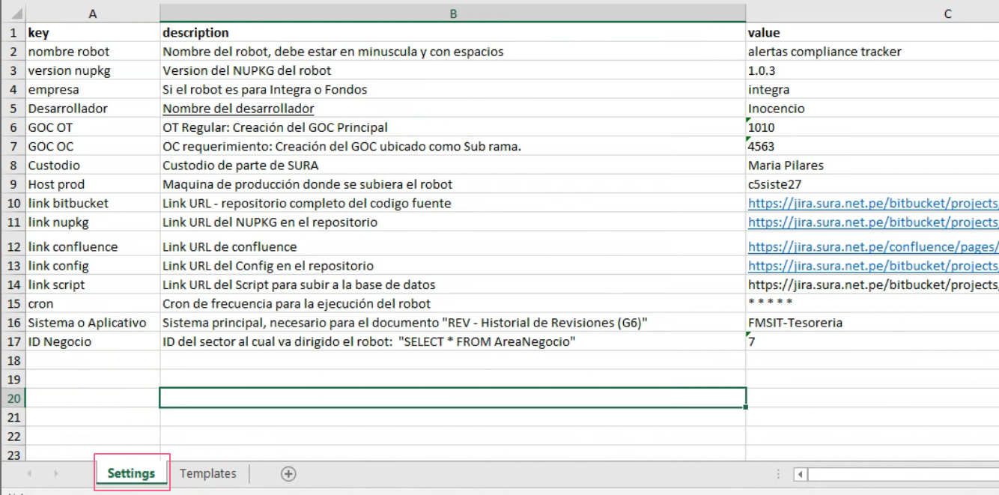
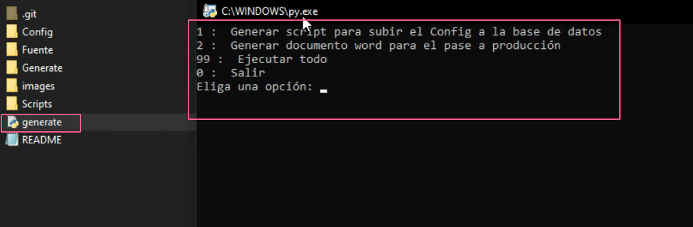

Generación de los documentos de producción RPA para Sura.
* ✅ Queries para subir el Config.xlsx a la base de datos
* ✅ `Production document`
* ✅ `PR`: Generacion de scripts
    * Te genera los scripts base, pero dependiendo del proceso se deberán agregar mas scripts
* ✅ `REV`: Revision de pares
* 🟡 `PO`: Plan de orden de trabajo.
    * Generación parcial, actualizar la pestaña "General" con las fechas de tu estimación
* ❌ `LR`: Lista de requerimiento (funcionales y no funcionales)
    * Pendiente
* ❌ `CP`: Casos de prueba y su detalle
    * Pendiente

> **Warning**: Solo usar para robots nuevos o si aun no has hecho el pase a producción

# Dependencias
Instalar Python 3.9.2: [Descarga](https://www.python.org/ftp/python/3.9.2/python-3.9.2-amd64.exe)



Instalar dependencias, ejecutar en Powershell.
```sh
pip3 install pandas
pip3 install openpyxl
pip3 install docxtpl
pip3 install Pillow
pip3 install editpyxl
pip install datatables
pip install Jinja2
```

# Guia de uso
Para que el script funcione correctamente se debe seguir el [estándar especificado](https://gitlab.com/grupo_rpa/rpa_002_manualprocedimientodesarrollorpa#estructura-codigo-fuente-del-proyecto).

Clonar o descargar el repositorio.



Copiar los siguientes documentos y archivos a la [raiz de su proyecto o repositorio](https://gitlab.com/grupo_rpa/rpa_002_manualprocedimientodesarrollorpa#creaci%C3%B3n-estructura-de-carpetas-seg%C3%BAn-est%C3%A1ndar-rpa-area-de-trabajo-y-fuente-proyecto)



Configurar el script usando el archivo `Generate\Generate.xlsx`



Ejecutar la funcionalidad deseada.
* 1. Genera las queries para subir el **Config.xlsx** a la base de datos
* 2. Genera el documento word **"Production Document.docx"**
* 3. Generar documentos PR, REV y PO
* 99. Ejecuta todas las funcionalidades anteriores
* 0. Salir del menu


